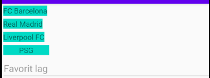
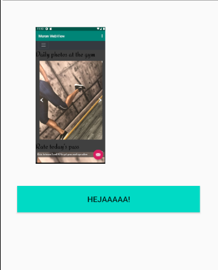

# Rapport

**Skriv din rapport här!**

I den här dugga skulle man följa olika steg för att kunna öva sig på hur man lägger till en layout.
Sedan ska man lägga till en knapp, EditText och en Imageview inuti layouten som man har valt att använda.
För att lösa layout kraven var man tvungen att implementera olika instruktioner på hur layout utseendet ska illustreras med hjälp av layout_width och height på canvasen av mobilen
sedan använder man sig av orientationen för att bestämma hur innehållet i layouten ska hålla sig till varandra.
Längre ner kan man se tre olika taggar med olika definition som EditText för att kunna få
resultatet enligt figur 1 och sedan har vi ImageView och Button där dessa två taggar kommer att illustrera en bild och en knapp enligt figur 2.

```
<TextView
        android:layout_width="wrap_content"
        android:layout_height="wrap_content"
        android:layout_margin="3dp"
        android:background="@color/colorAccent"
        android:text="FC Barcelona" />

        <EditText
                android:id="@+id/myNewEdt"
                android:layout_width="match_parent"
                android:layout_height="wrap_content"
                android:hint="Favorit lag" />

        <ImageView
                 android:id="@+id/imageView5"
                 android:layout_width="173dp"
                 android:layout_height="247dp"
                 android:layout_marginLeft="40dp"
                 android:layout_marginTop="40dp"
                 app:srcCompat="@drawable/figur1" />

        <Button
                 android:id="@+id/button"
                 android:layout_width="330dp"
                 android:layout_height="wrap_content"
                 android:layout_marginLeft="30dp"
                 android:layout_marginTop="40dp"
                 android:background="@color/colorAccent"
                 android:text="Hejaaaaa!" />
```

Bilder läggs i samma mapp som markdown-filen.




Läs gärna:

- Boulos, M.N.K., Warren, J., Gong, J. & Yue, P. (2010) Web GIS in practice VIII: HTML5 and the canvas element for interactive online mapping. International journal of health geographics 9, 14. Shin, Y. &
- Wunsche, B.C. (2013) A smartphone-based golf simulation exercise game for supporting arthritis patients. 2013 28th International Conference of Image and Vision Computing New Zealand (IVCNZ), IEEE, pp. 459–464.
- Wohlin, C., Runeson, P., Höst, M., Ohlsson, M.C., Regnell, B., Wesslén, A. (2012) Experimentation in Software Engineering, Berlin, Heidelberg: Springer Berlin Heidelberg.
